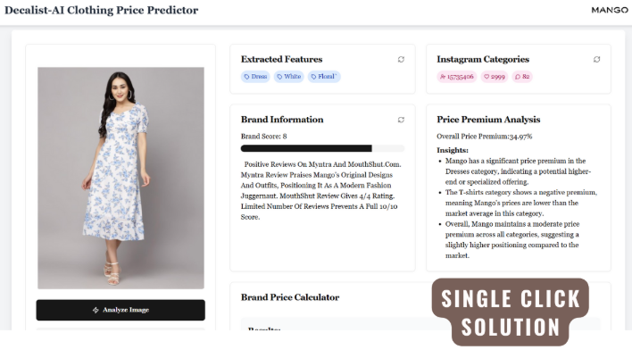
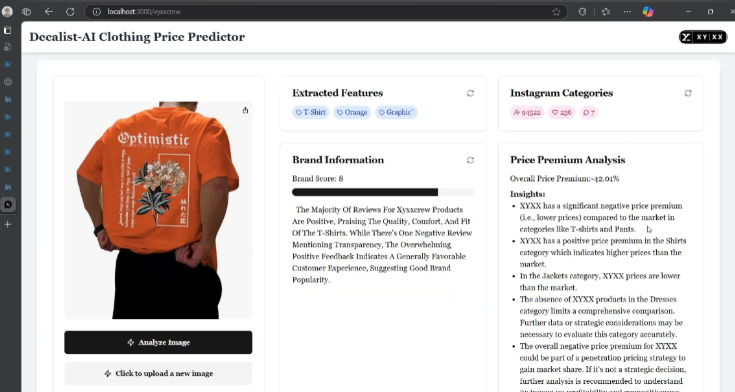

# Decalist: AI-Powered Fashion Pricing & Brand Optimization

## Problem
Billions of dollars in unsold fashion inventory, leading to waste and revenue loss.

## Solution
AI-driven insights for optimized pricing, brand perception, and customer-centric strategies. It performs automated scrapping of data from multiple e-commerce sites such as myantra , amazon and pulls data and leverages AI agents to such as Price Premium Agent , Social Media Analyser Agent , Price Perception Agents etc to give best price and analytics as solution offering to brands. This process earlier took dayas and teams efforts which is now reduced to minutes.




## Key Features
- **No-Code Tool:** Easy access to AI-powered pricing.
- **Brand Metrics:** Social media influence, customer sentiment, and competitor analysis.
- **Actionable Insights:** Tailored pricing, inventory, and promotions.

## Impact
- **Boosted Revenue:** Smarter pricing strategies.
- **Enhanced Customer Satisfaction:** Personalized offers.
- **Reduced Waste:** Precise demand forecasting.

## Tech Stack
- **Backend:** Django (Python)
- **Frontend:** Next.js (React)

## Getting Started

### Prerequisites
Ensure you have the following installed:
- Python (>=3.8)
- Node.js (>=16.0)
- PostgreSQL or SQLite (for local development)
- Redis (if using caching mechanisms)
- Docker (optional for containerized setup)

### Backend Setup (Django)
```bash
# Clone the repository
git clone https://github.com/adityapal0807/MLH-Fellowship-Codebase.git
cd decalist/Decalist_Codebase

# Create a virtual environment
python -m venv venv
source venv/bin/activate  # On Windows use `venv\Scripts\activate`

# Install dependencies
pip install -r requirements.txt

# Run migrations
python manage.py migrate

# Start the server
python manage.py runserver
```

### Frontend Setup (Next.js)
```bash
cd decalist/Decalist Frontend

# Install dependencies
yarn install  # or `npm install`

# Start the development server
yarn dev  # or `npm run dev`
```

## Usage
1. Navigate to `http://127.0.0.1:8000` for the backend API.
2. Navigate to `http://localhost:3000` for the frontend UI.
3. Configure environment variables in `.env` files for both frontend and backend.


